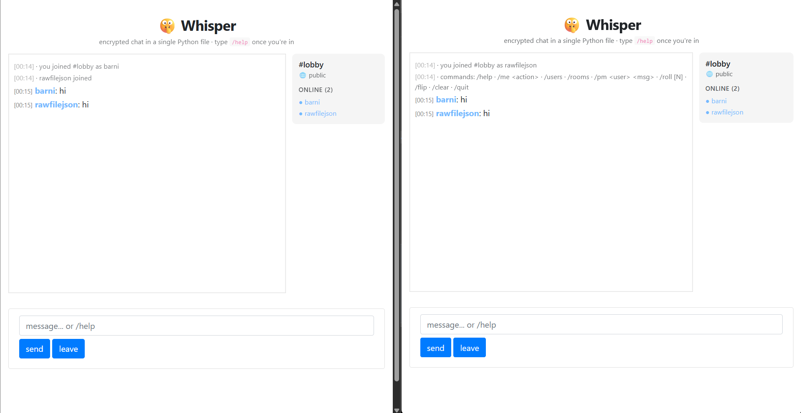

# 🤫 Whisper

> Encrypted real-time chat in a single Python file. No server framework, no JavaScript build, no database server. Just `python whisper.py` and you have a working chat with rooms, DMs, slash commands, and end-to-end-ish encryption.

<p align="center">
  
</p>

<p align="center">
  
  
  
  
</p>

---

## Why

Most chat demos either rely on a Node + React + Postgres + Redis stack just to send "hi", or they're 30 lines of toy code with no encryption, no rooms, no persistence, no rate limiting. Whisper is the middle ground — small enough to read in one sitting, real enough to actually use.

If you want to learn how a chat system works under the hood, or you need a private, self-hostable channel for a small group, this is for you.


<a href="https://www.buymeacoffee.com/rawfilejson" target="_blank"></a>


## Features

- 🔐 **Encrypted rooms** — set a password, messages are encrypted with **Fernet** (AES-128-CBC + HMAC-SHA256), keys derived via **PBKDF2-SHA256** (200k iterations). Without the password, the database is unreadable.
- 🏠 **Multiple rooms** — public ones (anyone joins) or private ones (password-gated).
- 💌 **Direct messages** — `/pm alice hey, you up?`
- 💾 **Persistent history** — SQLite under the hood, encrypted messages stay encrypted on disk.
- 🎨 **Auto-colored nicks** — each user gets a stable color hashed from their name.
- ⚡ **Slash commands** — `/help`, `/me`, `/users`, `/rooms`, `/pm`, `/roll`, `/flip`, `/clear`, `/quit`.
- 🐢 **Rate limiting** — 5 messages per 4 seconds, no spam.
- 📜 **Reads on join** — new users see the last 30 messages.
- 🧵 **No database server** — SQLite file, drop it anywhere.
- 📦 **One file, two deps** — `pywebio` and `cryptography`. That's the entire stack.

## Quick start

```bash
git clone https://github.com/rawfilejson/whisper.git
cd whisper
pip install -r requirements.txt
python whisper.py
```

Open `http://localhost:8080` in two browser tabs and chat with yourself like it's 2003.

## Usage

### Joining

When you open the page you get three fields:

| Field | What it does |
|---|---|
| **Nickname** | Your display name. Must be unique across all online users. |
| **Room** | The room to join. If it doesn't exist, it's created. |
| **Room password** | Optional. If set, all messages in that room are encrypted with a key derived from this password. |

A room created without a password stays public forever. A room created with a password is private forever — anyone joining must supply the same password or they're rejected.

### Slash commands

| Command | Effect |
|---|---|
| `/help` | List all commands |
| `/me <action>` | `* alice waves` style action |
| `/users` | List people in the current room |
| `/rooms` | List all public + private rooms |
| `/pm <user> <message>` | Send a direct message to someone online |
| `/roll [N]` | Roll a d100 (or d`N`) |
| `/flip` | Coin flip |
| `/clear` | Clear your local view (others still see history) |
| `/quit` | Leave the chat |

## How the encryption works

Whisper uses **password-derived symmetric encryption**, not full E2EE with key exchange. That's the honest framing.

```
room password
     │
     ▼
PBKDF2-SHA256 (200,000 iterations, fixed app salt)
     │
     ▼
32 bytes  →  base64  →  Fernet key
     │
     ▼
encrypt(message) → stored in SQLite + relayed
decrypt(token)   → on each user's session
```

**What this means in practice:**

✅ The SQLite file is unreadable without the room password.
✅ Server operators who only have disk access can't read message contents.
✅ Two users with the same password share a secure channel against passive observers.

❌ The server *process* holds the key in memory while users are connected (that's how it routes messages). If you don't trust the host machine, this is not enough — you want Signal.
❌ The app salt is in the source. Change it before deploying for real, or messages encrypted under the old salt become unreadable.

For a hobby/lab/team chat: this is plenty. For a journalist communicating with a source under nation-state threat: use something else.

## Architecture

```
┌──────────────────────────────────────────────────────────────┐
│                     pywebio session                          │
│   ┌────────────┐    ┌─────────────────┐    ┌─────────────┐  │
│   │ message    │    │ refresh task    │    │ sidebar     │  │
│   │ input loop │    │ (polls rooms[]) │    │ refresher   │  │
│   └─────┬──────┘    └────────┬────────┘    └──────┬──────┘  │
└─────────┼────────────────────┼─────────────────────┼─────────┘
          │                    │                     │
          ▼                    ▼                     ▼
   ┌─────────────────────────────────────────────────────────┐
   │            rooms[] in-process state                     │
   │  { "lobby": {key, users, msgs: deque(maxlen=200)}, ... } │
   └────────────────────┬────────────────────────────────────┘
                        │
                        ▼  (only real messages, encrypted form)
                ┌───────────────┐
                │  whisper.db   │  ← SQLite, single table
                └───────────────┘
```

Every user session runs an `asyncio` polling task that watches `rooms[name]["msgs"]` and renders any new entry it hasn't shown yet. Messages from the current user are rendered locally on send (no round trip), so latency feels instant.

## Configuration

All the knobs are at the top of `whisper.py`:

```python
DB_PATH       = "whisper.db"
HISTORY_LIMIT = 200       # messages kept in memory per room
LOAD_ON_JOIN  = 30        # how much history a joining user sees
RATE_WINDOW   = 4.0       # seconds
RATE_LIMIT    = 5         # max messages per window
MAX_MSG_LEN   = 800
APP_SALT      = b"whisper-v1-change-me-in-prod"   # CHANGE THIS
```

## Deployment notes

If you want to run this on a public box:

1. **Change `APP_SALT`** — first thing, before anyone uses it.
2. **Set `debug=False`** in `start_server(...)`.
3. **Put it behind nginx/caddy with TLS.** The cryptography is symmetric and password-based; the transport still needs HTTPS or anyone on the wire can sniff your traffic.
4. **Run it as a systemd unit** or under `tmux` — pywebio doesn't daemonize itself.
5. **Back up `whisper.db`** if you care about history.

## Roadmap

- [ ] File/image attachments (small)
- [ ] Optional Tor hidden-service deployment guide
- [ ] WebSocket-native pub/sub instead of polling
- [ ] Per-message reactions
- [ ] Export room history as encrypted archive

PRs welcome.

<a href="https://www.buymeacoffee.com/rawfilejson" target="_blank"></a>

## License

MIT — do whatever you want, just don't sue me.

Built by [@rawfilejson](https://github.com/rawfilejson).
